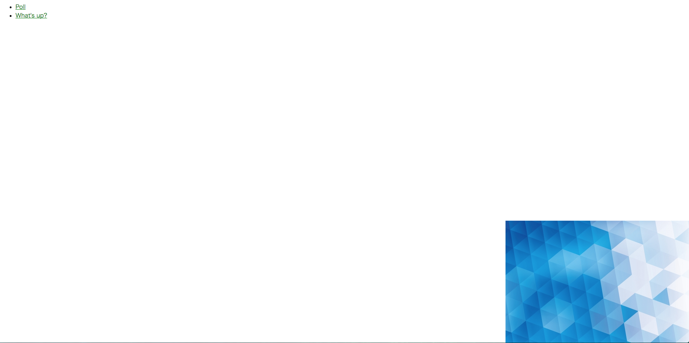
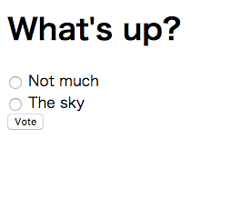
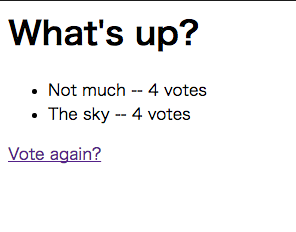
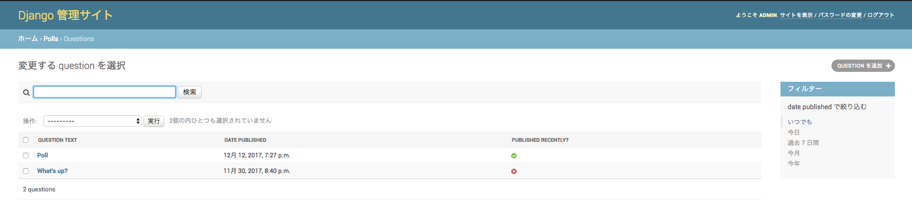

djangoTutorial

[はじめてのDjangoアプリ作成](https://docs.djangoproject.com/ja/1.11/intro/tutorial07/)を実装  

# 環境情報

[DjangoAdmin](http://localhost:8000/admin)の管理者アカウントは，以下の通り  

User: admin  
Pass: djangoTutorial

# アプリ説明

http://localhost:8000/polls に接続すると，質問一覧画面．  

  

質問のリンクをクリックすると，投票画面，  

  

項目を選択して，`Vote`で，投票結果画面．  

## Admin画面のレイアウト変更

コンテンツ管理画面で，投稿時間によって，最近かそうでないかの判定．

  
