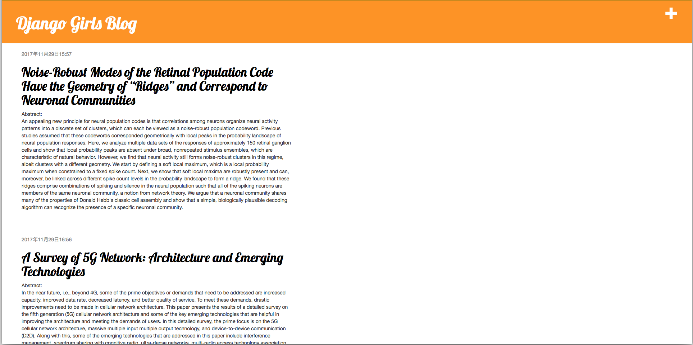

# Django Girls Tutorial

[Django Girls Tutorial](https://djangogirlsjapan.gitbooks.io/workshop_tutorialjp/content/)を一通りやったリポジトリ．

# How to use
このリポジトリをcloneしたあと，

```bash
$ python manage.py runserver
```
でサーバが起動する．  

http://localhost:8000 でHome画面にアクセス．



## 管理者ページ
http://localhost:8000/admin で管理者画面に入る．  
ユーザ名：admin  
パスワード: djangogirls  


