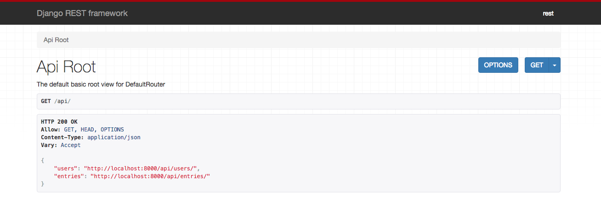
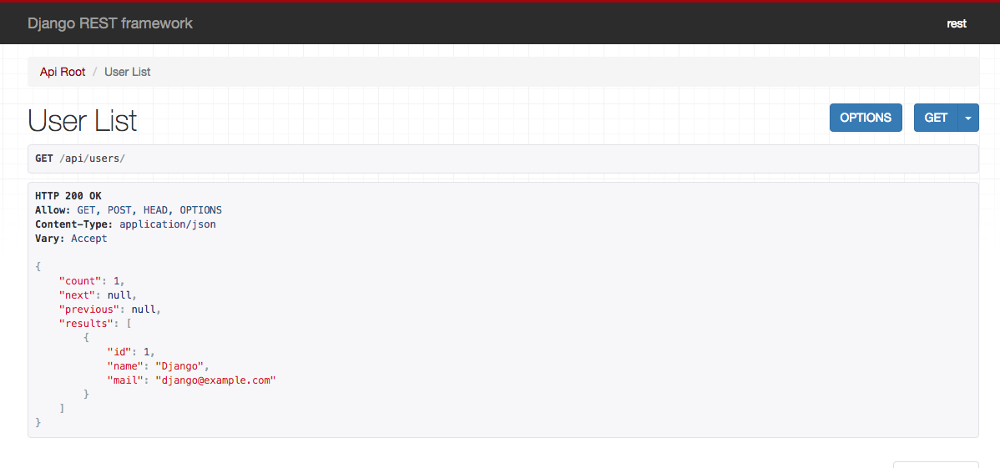
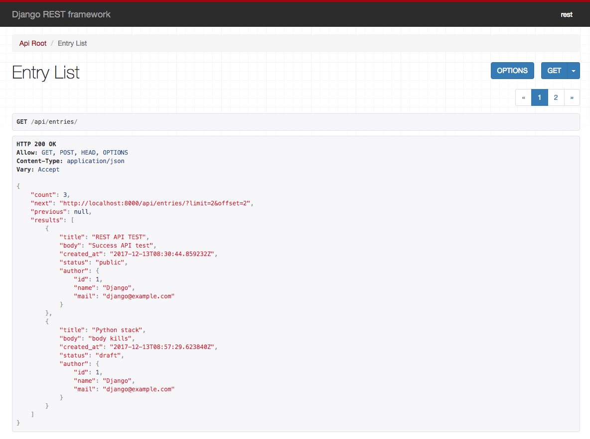

django REST Framework

[Qiitaの記事](https://qiita.com/kimihiro_n/items/86e0a9e619720e57ecd8#api動作確認)をベースにdjangoのREST APIのフレームワークを実装．

`confFile`にapache2の設定ファイルを格納(Ubuntu)

## 動作環境
### OS
MacOS Sierra 10.12.6  
Ubuntu 16.04 LTE

### Library
Django == 1.11.7  
django-filter == 1.1.0  
django-filters == 0.2.1  
djangorestframework == 3.7.3  

## Admin
User: rest  
pass: djangorest

## 内容
チュートリアル等で実装できるブログシステムの記事タイトル・記事内容をAPIでjson形式で取得できる．

http://localhost:8000/api/users でユーザ情報API

http://localhost:8000/api/entries で投稿情報API  

### GETパラメータ
`/api/entries/?author=`で作成ユーザの絞り込みが可能．  
`/api/entries/?status=`で投稿状態を絞り込み [`public`, `draft`]
